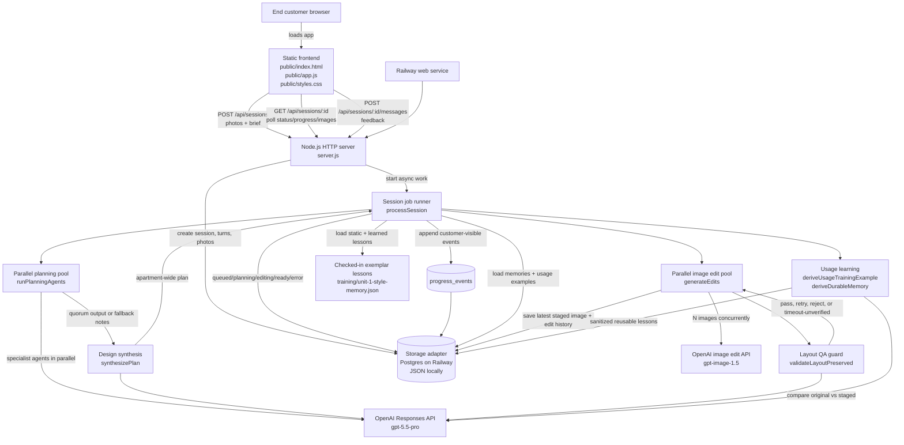

# Architecture Diagram

This diagram shows the production runtime for VirtualStage NYC on Railway. The app is a single Node.js service that performs concurrent asynchronous OpenAI work: multiple planning agents can run at the same time, image edits are generated by a worker pool, and the browser polls persisted progress events while long-running work continues server-side.

## Runtime Flow

1. The browser uploads up to `MAX_IMAGE_COUNT` photos and a staging brief to `POST /api/sessions`.
2. The server persists the session immediately, returns a session id, and starts `processSession` in the background.
3. The frontend polls `GET /api/sessions/:id` and renders persisted progress events. This is why long OpenAI work does not need to keep the original upload request open.
4. Planning loads checked-in exemplar lessons, learned memories, and recent usage examples.
5. `runPlanningAgents` starts specialist planners in parallel. By default, it gives all planners up to three minutes to finish, then proceeds once at least two planner outputs are available.
6. `synthesizePlan` produces one apartment-wide theme and one per-photo edit plan.
7. `generateEdits` runs a bounded parallel worker pool. Each worker edits a photo, runs layout QA, retries if allowed, and saves the accepted result.
8. Feedback messages create a new user turn and re-run the workflow against the original uploads, not against the prior generated images.
9. Completed sessions are distilled into sanitized reusable lessons and stored as future prompt context.

## Concurrency Controls

- `OPENAI_PLANNING_AGENT_CONCURRENCY`: how many specialist planners may run at once. Default: `4`.
- `OPENAI_PLANNING_SOFT_TIMEOUT_MS`: how long to wait before allowing a quorum to unblock synthesis. Default: `180000`.
- `OPENAI_PLANNING_MIN_AGENTS`: minimum completed planner outputs required before synthesis can proceed. Default: `2`.
- `OPENAI_EDIT_CONCURRENCY`: how many photo edits may run at once. Default: `4`.
- `OPENAI_AGENT_TIMEOUT_MS`, `OPENAI_SYNTHESIS_TIMEOUT_MS`, `OPENAI_EDIT_TIMEOUT_MS`, and `OPENAI_LAYOUT_QA_TIMEOUT_MS`: hard upper bounds for slow OpenAI operations.

This is not CPU-thread parallelism. The workload is network-bound OpenAI API work, so the app uses Node.js async concurrency and bounded Promise pools. That gives the user-visible benefit of parallel execution without adding worker-thread complexity.
